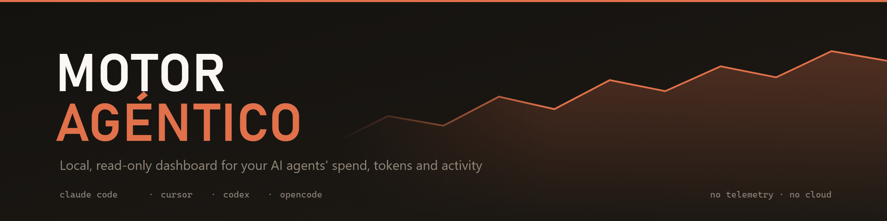
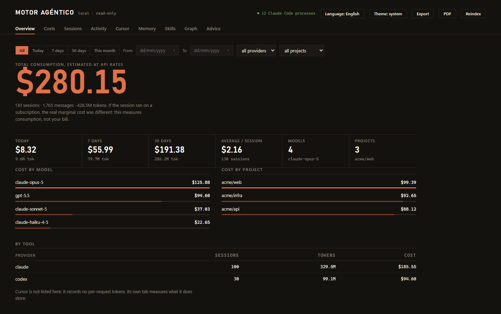

<p align="center"></p>

<div align="center">

[](LICENSE)  

</div>

**Local, read-only dashboard for your AI agents' spend, tokens and activity.**

It reads what Claude Code, Cursor, Codex and OpenCode already write to your disk, and tells you
how much you consume, on which models, in which projects and with which tools. Everything is
computed on your machine: no server, no account, no telemetry, not a single outbound request.

**English** · [Español](README.es.md)

<p align="center"></p>
<p align="center"><sub>Overview tab. The data in the screenshot is synthetic.</sub></p>

---

## What it answers

- How much am I spending on AI — today, this week, this month?
- Which models do I actually use, and what does each one cost?
- Which sessions eat the budget?
- Where do the tokens go: input, output or cache?
- Which tools, skills and subagents are actually being used?
- What is stored in my memory system?
- Which working patterns could be improved?

## Requirements

- **[Bun](https://bun.sh) ≥ 1.3** — that is the only requirement.
- At least one of the supported tools, with data on disk.

**No dependencies.** There is no `npm install`, no `node_modules`, no build step. The server,
the SQLite database and the dashboard all use what Bun ships with.

## Install

```bash
git clone https://github.com/ASanchezT85/agent-engine.git
cd agent-engine
bun run serve
```

Open **http://127.0.0.1:4823**. The first run indexes on its own; after that it starts cold.

To use a different port:

```bash
PORT=4824 bun run serve
```

## Commands

| Command | What it does |
|---|---|
| `bun run serve` | Starts the dashboard. Indexes only if the database is empty |
| `bun run detect` | Lists the tools it finds, without touching the database |
| `bun run index` | Incremental indexing |
| `bun run audit` | Verifies the read-only guard and regenerates the recommendations |
| `bun test` | 31 tests |

The **Reindex** button in the dashboard runs an incremental pass without restarting anything.

---

## Supported tools

| Tool | Where it reads from | What it gets |
|---|---|---|
| **Claude Code** | `~/.claude/projects/**/*.jsonl` | tokens, cost, models, tool calls, skills, subagents, MCP, memory |
| **Cursor** | `state.vscdb` in Cursor's `globalStorage` (Windows / macOS / Linux) and `~/.cursor/ai-tracking/ai-code-tracking.db` | sessions, models, tool calls, lines written, % AI authorship per commit |
| **OpenAI Codex CLI** | `~/.codex/sessions/**/rollout-*.jsonl` | tokens, cost, model, reasoning effort, tool calls |
| **OpenCode** | `~/.local/share/opencode/storage/**` (honours `XDG_DATA_HOME`) | tokens, **its own computed cost**, model, agent, tool calls |

A tool that is not installed shows up as *not detected*. Nothing is invented.

**Maturity, stated plainly:** Claude Code and Cursor are tested against real data. Codex and
OpenCode were written against the format verified by reading each project's source
(`openai/codex`, `anomalyco/opencode`) and are covered by fixtures, but **not against a real
installation**, because the author does not use them. If their format has since changed, you
will see sessions without tokens — never invented data.

**Operating systems:** all four adapters resolve their paths per platform. Cursor is a VS Code
fork, so its `globalStorage` follows the Electron layout: `%APPDATA%\Cursor` on Windows,
`~/Library/Application Support/Cursor` on macOS, `${XDG_CONFIG_HOME:-~/.config}/Cursor` on
Linux. All candidates are probed and the first one that exists wins. Developed and tested on
Windows 11; the macOS and Linux paths are covered by unit tests but have not been run against a
real installation on those systems.

---

## The rule that governs everything: read-only

Your tools' folders (`~/.claude`, `~/.codex`, `~/.cursor`, `~/.opencode`) are treated as
**strictly read-only**. That is not a promise, it is a constraint in the code:

- Every access to foreign disk goes through `src/core/paths.ts`, which opens with `O_RDONLY`.
- `assertReadOnly(path, "write")` throws if the path falls under a foreign root. There is a
  test for it.
- **Hard path denylist**: `.credentials.json`, `.env*`, `*.key` and SSH keys are not even read.
- Everything the Engine writes lives in `data/`, inside the project itself.

Cursor keeps its databases in WAL mode and writes to them while the app is open. Opening them
in place — even `readonly` — would make SQLite want to create a `-shm` next to the original,
and that is already writing into someone else's folder. So the adapter **copies** the `.db`
files (with their `-wal` and `-shm`) into `data/cursor-cache/` and reads the copy. A test
creates a toy WAL database and verifies the source directory is byte-for-byte identical after
reading.

## Privacy

- The server listens on **`127.0.0.1` only**.
- Zero telemetry, zero analytics, zero runtime dependencies.
- **Not a single transcript is uploaded anywhere.**
- **Conversation text is not stored.** Only the session title and the first prompt, truncated to
  200 characters and already redacted. Message bodies never enter the database.
- Secret redaction (`src/core/redact.ts`) on ingest and again when serving memory and skills:
  Anthropic/OpenAI/GitHub/Slack/AWS/Google keys, JWTs, private keys, `Authorization`/`Cookie`
  headers and `PASSWORD=`-style assignments.
- `data/` is in `.gitignore`: the database, the Cursor cache and the exports **are not pushed**.

If you publish a screenshot of the dashboard, keep in mind it shows real session titles and
project paths.

---

## Costs

`config/pricing.json` is the **only** source of rates; there are never prices in the code. Each
vendor carries its source and verification date:

| Vendor | Source | Models |
|---|---|---|
| anthropic | <https://platform.claude.com/docs/en/about-claude/pricing> | Fable/Mythos 5, Opus 5→4, Sonnet 5→4, Haiku 4.5/3.5 |
| openai | <https://developers.openai.com/api/docs/pricing> | gpt-5.6 (sol/terra/luna), 5.5, 5.4 (+mini/nano/pro), 5.3-codex, 5.2, 5.1, 5, mini, nano |

A model with no rate is flagged `UNVERIFIED`, its cost counts as 0, and it surfaces as a warning
in the dashboard and in the recommendations. **A price is never invented.**

To add or fix a rate, edit `config/pricing.json` and update `verifiedAt`. No code changes needed.

**The two vendors charge for cache differently, and the engine respects that:**

- **Anthropic** charges a premium for cache *writes* (1.25x at 5 min, 2x at 1 h) and 0.1x for
  reads.
- **OpenAI** does not charge extra for writes: they bill at the normal input rate; only reads
  are cheaper. That is why its models carry `cacheWrite5m = cacheWrite1h = input`.

Fast mode (Opus 5/4.8 and gpt-5.3-codex) and Anthropic's 1.1x `inference_geo: "us"` multiplier
are applied too.

> ### Costs are estimates at API rates
> If your sessions ran on a subscription (Claude Pro/Max, ChatGPT Plus…), the real marginal cost
> was different — probably zero. **The number measures consumption, not your invoice.**

---

## Dashboard features

- **Overview** — spend today / 7 / 30 days, cost by model and project, token breakdown.
- **Costs** — daily, weekly and monthly series.
- **Sessions** — sortable, searchable table; each session opens in detail.
- **Activity** — live processes, recent sessions, tools, skills, subagents, MCP, activity by
  hour and by day of week.
- **Cursor** — % of code written by AI, authorship per branch, sessions and models.
- **Memory** — inventory of the persistent memory, redacted.
- **Skills** — which skills you have and which you actually use.
- **Graph** — projects ↔ tools / skills / subagents.
- **Advice** — automatic recommendations (see below).

**Filters** by date range (with presets), provider and project. They live in the URL, so a given
view can be shared, reloaded, and navigated with the browser's back/forward.

**Export** writes JSON + CSV into `data/exports/`, honouring the active filter. The JSON declares
which sections were filtered and which were not, with the reason.

**PDF** prints the current view with its filter, using the browser's own print engine.

**Theme** light / dark / system, and **language** Spanish / English with auto-detection.

## Recommendation engine

It analyses what has been indexed and **proposes**, never applies. Recommendations are saved to
`data/recommendations.json`; the Engine never modifies your tools' configuration.

It detects: disproportionately expensive sessions, poor cache reuse, huge contexts, barely-used
tools, repeated prompts that are skill candidates, projects with heavy manual command execution,
and models with no rate.

---

## Architecture

```
config/pricing.json        rates, decoupled from the code
src/core/paths.ts          read-only guard, denylist, offset-based reading
src/core/redact.ts         secret detection and redaction
src/core/pricing.ts        model normalisation + cost engine
src/core/jsonl.ts          incremental JSONL reading, shared across adapters
src/core/db.ts             SQLite schema
src/core/analytics.ts      overview, costs, sessions, activity and graph queries
src/core/inventory.ts      skills, memory and live processes (hot scan)
src/core/recommend.ts      recommendation engine
src/core/export.ts         JSON and CSV export
src/providers/*.ts         one adapter per tool + registry
src/server/server.ts       HTTP API + static files
web/                       dashboard (HTML/CSS/JS, hand-rolled SVG charts, no frameworks)
test/engine.test.ts        31 tests
```

**The backend sends no prose.** Provider notes and recommendations travel as a translation key
plus numbers (`{ id: "cache-churn", params: { written: 833.8, read: 44310 } }`); the front-end
supplies the text. That way there are never two copies of the same paragraph, and no backend
deciding presentation.

### Incremental indexing

`files(path, size, mtime, offset)` stores the exact byte up to which each transcript was read:

1. If `size` and `mtime` did not change → the whole file is skipped.
2. If it grew → **only** the bytes from `offset` are read.
3. If it shrank → reindexed from 0 (file was rewritten).
4. A trailing line without `\n` (a session writing right now) is not consumed: the offset stops
   before it, and that line is read whole on the next pass.

No file is ever loaded fully into memory: it is read in 4 MB chunks. On the development machine,
with 1.5 GB of transcripts and a single 402 MB file, the first index took ~19 minutes and later
passes 0.4 s.

### Adding a tool

Implement the `Provider` interface from `src/core/types.ts`:

```ts
export const myProvider: Provider = {
  id: "mytool",
  label: "My Tool",
  detect() { /* { installed, root, note: "i18n.key", noteParams } */ },
  index(db) { /* returns { files, newBytes, messages } */ },
};
```

Register it in `src/providers/registry.ts` and add its strings to `web/i18n.js`. House rules:
**never write** into the tool's folder, use `assertReadOnly`, pass free text through `redact()`,
and honour the `size`+`mtime` freshness gate.

---

## Measurement traps this project already hit

Documented because anyone measuring the same thing will run into them:

- **Cumulative usage must not be summed.** Codex's `total_token_usage` is cumulative per session,
  not per turn; summing the events multiplies spend by the number of turns. (This is the 91x
  inflation bug reported in `ccusage`.) The maximum is taken instead.
- **Reported input already includes the cached part.** It has to be subtracted, or cache tokens
  are counted twice.
- **The filter cuts messages, not sessions.** If it cut sessions, one that merely grazes the
  range would contribute its entire cost and the sum would stop matching the total. A test pins
  the invariant.
- **Cache writes do not cost the same across vendors.** See the costs section.
- **Filter dropdowns are populated unfiltered.** If they were filtered, picking a project with a
  single session would empty its own dropdown, leaving no way back.

## Known limitations

- **Cost ≠ invoice.** See above.
- **Cursor records no per-request tokens** (they all come through as 0), so it stays out of the
  money figures. Its tab measures what it does store: authorship, sessions, models, tools.
- A Cursor session's peak context is the last measurement, not a running total.
- **A PID is not matched to its session**: no field ties them together. Live processes are shown,
  and separately, which sessions wrote in the last 10 minutes.
- A skill's "uses" counts invocations through the `Skill` tool; a skill loaded by a hook or by
  `SessionStart` leaves no trace.
- Tokens are attributed to the day of the message, not to the billing day.
- **Chrome printing bug**: in a table spanning pages, non-ASCII glyphs from the repeated header
  (the Ó in "DURACIÓN") are drawn at the original header's coordinates and end up loose at the
  foot of the page as a ~1 mm mark. There is a commented switch in `web/style.css` to disable
  header repetition if the mark bothers you more than losing the labels.

## Status

It works and is in use. There is no semantic versioning and no compatibility promise. Issues
and PRs are welcome.

## Contributing

See **[CONTRIBUTING.md](CONTRIBUTING.md)** for how to get set up, the rules that are not up for
negotiation (never write into a tool's folder, never invent a number), how to add a provider,
and what is most wanted:

- confirmation of the Codex and OpenCode adapters against real installations;
- new or corrected rates in `config/pricing.json`;
- a provider for another agent.

## License

[MIT](LICENSE) © 2026 Alexander J Sanchez T
